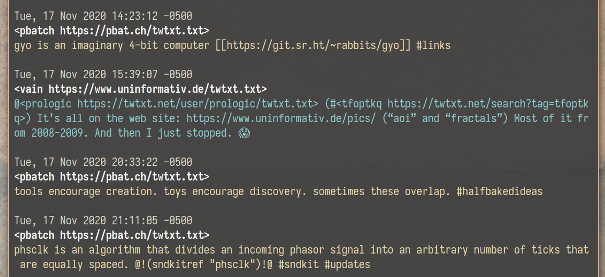
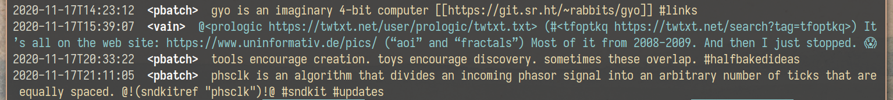

tt
==
A more-unixy [twtxt](https://github.com/buckket/twtxt) client.

Doesn't force you to maintain a master "following" file (the way Twitter does),
but let's you point it to any follow-file every time it runs.

This means unlimited possibilities for ad-hoc, interesting filtering
combinations. Especially when paired with
[process substitution](https://en.wikipedia.org/wiki/Process_substitution).

### long format (default)

### short format (CLI option: -s)

instructions
------------

### requirements
[Racket](https://download.racket-lang.org/)

### installation
1. Run `make install` or `raco pkg install`
2. Add `$HOME/.racket/7.9/bin` to your `$PATH`
   (replacing `7.9` with whatever version you have installed)

### usage
`tt (FOLLOW-FILE)`

notes
-----

### LWW downloads
Downloaded timelines are stored in `~/.tt/cache/<SHA1_OF_URI>`, but no attempt
is made to preserve the previously-downloaded messages - each download
overrites the previous. One of the implications is that authors can edit/delete
history without you noticing.
